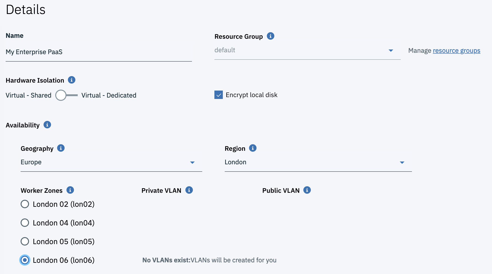
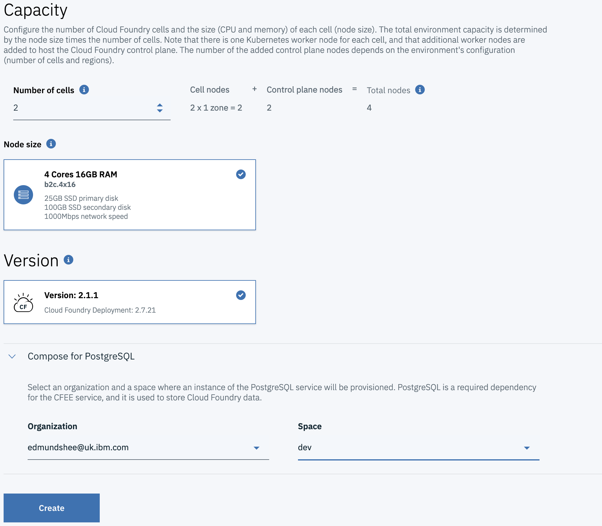
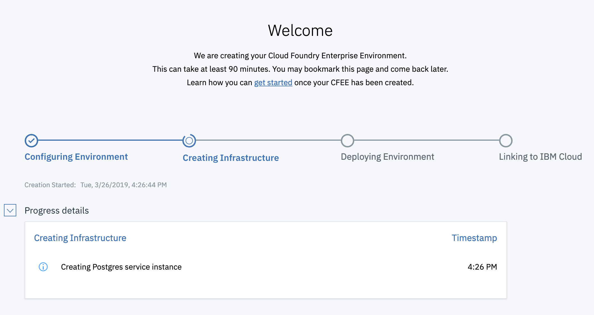

##Run your own enterprise PaaS using Cloud Foundry

As a Cloud Foundry user, it's super easy to deploy your code without having to worry about the infrastructure underneath. Managed Cloud Foundry providers like [IBM Cloud](https://cloud.ibm.com) allow a seemingly indefinite amount of compute which gives the user great flexibility. The most common objections to running workloads in this way is that they are public-facing and that the compute resources are multi-tenant. What often happens is that companies end up running Cloud Foundry on top of their own infrastructure in order to combat these objections. Now they have a single-tenant environment and they can control the networking themselves.

The downside? Running, managing, patching and updating a Cloud Foundry deployment have now all become problems that the company owns. On top of this, they need to monitor and manage the underlying infrastructure too. The company's developers may have the same great user experience that Cloud Foundry provides but there is now a significant operations overhead.

In 2018 IBM launched [Cloud Foundry Enterprise Environment](https://cloud.ibm.com/docs/cloud-foundry?topic=cloud-foundry-about#about) to address exactly these concerns. The service allows self-service provisioning of an entire Cloud Foundry platform, running on the level of compute and networking isolation of your choice.

Getting started with your own environment is really easy:
- Select Cloud Foundry from the menu and click `Create` under "Enterprise Environment"
- Choose your desired geographical region, availability zone and hardware isolation

- The capacity of your Cloud Foundry environment can be adjusted by choosing the number of cells

- Hit `Create` and the environment will automatically be provisioned for you

- The environment takes a little while to provision and set up (it's creating an entire Cloud Foundry platform for you!) but the welcome screen keeps you up to date with progress
